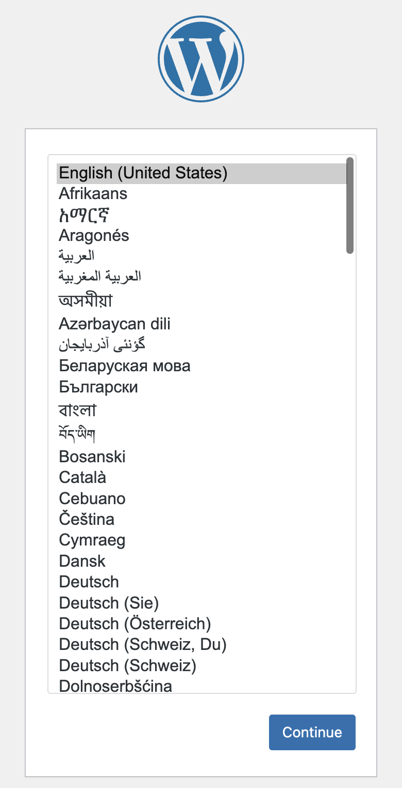
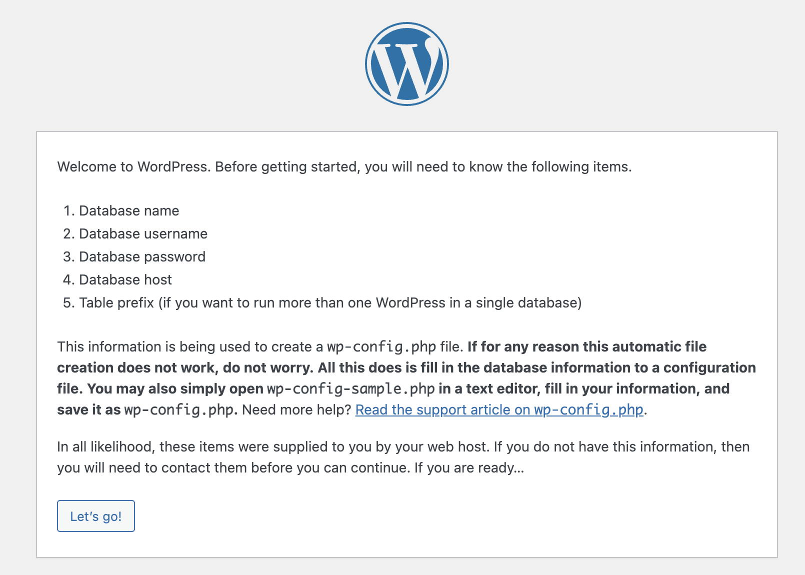

# Run Your Own Instance of Wordpress on AWS.

#### This repository contains all components required to deploy and run a production-ready instance of Wordpress on AWS

## 1. Building the Amazon Machine Image (AMI).
* [Install](https://developer.hashicorp.com/packer/tutorials/aws-get-started/get-started-install-cli) Hashicorp Packer.


## 2. Initializing a New Wordpress Server
2.1 Launch an EC2 instance from AMI `iurisman-wp-ubuntu` built in step 1. Be sure to use an SSH keypair and to choose 
a security group that allows SSH, HTTP, and HTTPS inbound traffic and all outbound traffic. 

2.2 SSH onto the instance with
```shell
$ ssh -i /path/to/private/key ubuntu@<public-ip-address>
```

2.3 Setup the database schema by running
```shell
$ bin/schema.sh
```
Since this is a new MySQL instance, you will be prompted to created passwords for two database users: The user `root`
is the superuser account that will be (optionally) used for database backups. The user `wp_user` is the account
who will own the `wp` database required by Wordpress. You may edit the script before running it if you'd rather use
different names for the Wordpress database or account. 

2.4 Point your browser to the EC2 instance at `http://<public-ip-address>`. This will bring the Wordpress language 
dialog:

Chose your language and press `Continue`

2.5 This will bring the Wordpress setup dialog:

2.6 Press `Let's Go`. On the next page, enter the following information:
```text

Database Name       `wp`
Username	        `wp_user`
Password	        The database user password you entered in step 2.3.
Database Host	    Leave the default `localhost`
Table Prefix        Leve the default `wp_`
```

## 3. DNS and SSL Changes (TBD)
* Static IP address
* Update DNS
* Once it works, cut certificate
```shell
$ sudo certbot --apache
```
## 4. Optional Post-Initialization Steps
### 4.1. Periodic Status Check
### 4.2. Periodic Backups

## 5. Advanced Topics
### 5.1. Running muliple sites from the same server.
