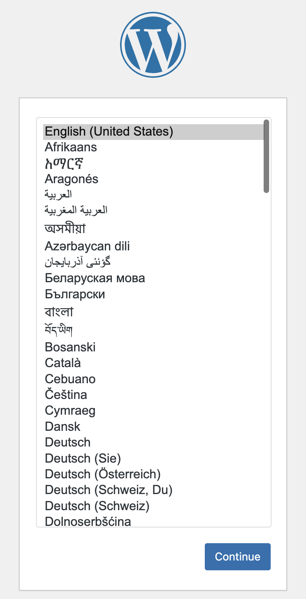
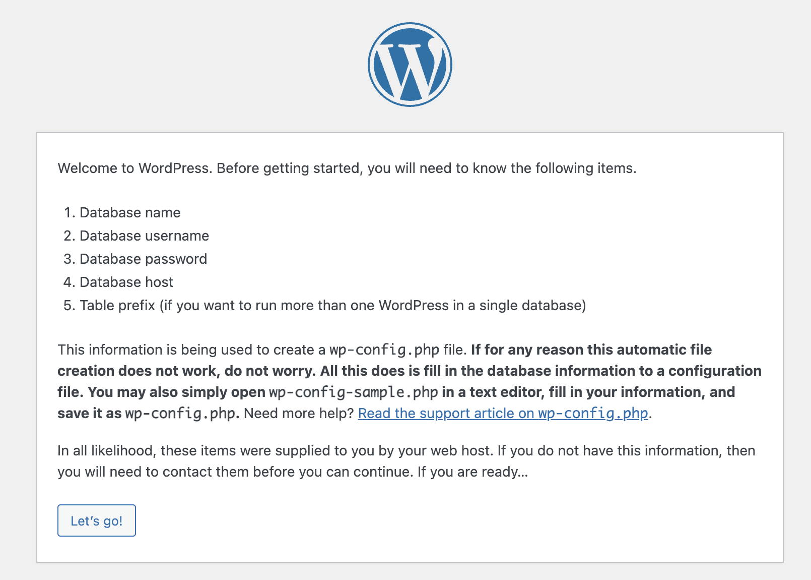

# Run Your Own Instance of Wordpress on AWS.
By Igor Urisman

#### This repository contains all you need to deploy and run a production-ready instance of Wordpress on AWS

This README presumes basic familiarity with AWS and the AWS Console.

### 1. Building the Amazon Machine Image (AMI).

1.1 [Install](https://developer.hashicorp.com/packer/tutorials/aws-get-started/get-started-install-cli) Hashicorp Packer.

1.2 Change current directory to `ami`. Edit `aws-wp-ubuntu.hcl` with your details.

1.3 Pull the Hashicorp `aws` plugin for ubuntu:
```shell
$ packer install .
```
1.4 Build the AMI:
```shell
$ packer build aws-wp-ubuntu.pkr.hcl 2>&1 > build.log 
```
This will build the `wordpress-ubuntu` AMI with everything installed. Inspect the log file
for errors with `less -R`.

### 2. Initializing a New Wordpress Server
2.1 Launch an EC2 instance from AMI `wordpress-ubuntu` built in step 1. Be sure to use an SSH keypair and to choose 
a security group that allows SSH, HTTP, and HTTPS inbound traffic and all outbound traffic. 

2.2 SSH onto the instance with
```shell
$ ssh -i /path/to/private/key ubuntu@<public-ip-address>
```

2.3 Create an Elastic IP Address and associate it with the running instance. If you're
restoring from a backup, reuse the Elastic IP Address from the server you're restoring.

2.4 Update your domain's DNS A for mydomain.com (and likely CNAME for www.mydomain.com) records. Skip this step
if you're restoring from a backup.

2.5 __Once the DNS change has propagated__, create an SSL certificate:
```shell
$ sudo certbot --apache
```
Enter both mydomain.com and www.mydomain.com. 

2.6 Setup the Wordpress database schema by running
```shell
$ bin/schema.sh
```
Since this is a new MySQL instance, you will be prompted to created passwords for two database users: The user `root`
is the superuser account that will be (optionally) used for database backups. The user `wp_user` is the account
who will own the `wp` database required by Wordpress. You may edit the script before running it if you'd rather use
different names for the Wordpress database or account.

2.7 Point your browser to the EC2 instance at `mydomain.com`. 

__You must be connected via HTTPS (the lock icon visible
in the browser's URL bar) to proceed with the installation of Wordpress. Otherwise, wordpress installation will use
the non-secure self address and Wordpress will stop working and the installation of the SSL certificate.__

This will bring the Wordpress language 
dialog:

Chose your language and press `Continue`

2.8 This will bring the Wordpress setup dialog:

2.9 Press `Let's Go`. On the next page, enter the following information:
```text
Database Name     `wp`
Username          `wp_user`
Password          The database user password you entered in step 2.3.
Database Host     Leave the default `localhost`
Table Prefix      Leve the default `wp_`
```

### 3. Optional Post-Installation Steps
#### 3.1. Periodic Status Check
#### 3.2. Periodic Backups
To setup the backups edit the crontab file:
```shell
crontab -e
```
adding the following line:
```
35 7 * * * ./bin/backup.sh /var/www/html <mysql-user> <mysql-password> <s3-bucket> > backup.log 2>&1
```
`<wordpress-root-directory>` is typically `/var/www/html`

`<mysql-user>` is typically `root`, unless you edited `schema.sh`.

#### 3.3. Restoring from a Backup
NB: The Site URL is saved in Wordpress database as a general setting. The process below 
will only work for restoring for the same domain name. 
1. Launch a fresh EC2 instance from the Wordpress AMI built in Section 1 and `ssh` to it.
2. Copy the latest ZIP backup from S3:
```shell
aws s3 cp <S3-URL> .
```
3. Unzip
```shell
unzip site-backup-<date>.zip 
```
This will inflate 2 files: the wordpress backup TAR archive and the MySQL export SQL file.
4. Untar the wordpress backup and simply move the var/www/html to /var/www/
5. Before you can run the mysql restore, repeate step 2.6 to create the root mysql account
Then run
```shell
mysql -u root --password=root-password < mysqldump.sql
```
6. Repeat steps ...

### 5. Advanced Topics
#### 5.1. Site monitoring

#### 5.2. Running muliple sites from the same server. (TBD)
